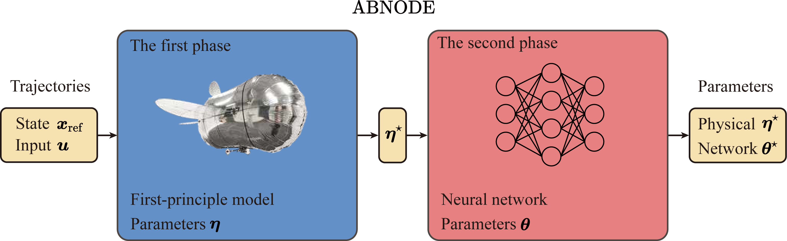

# ABNODE

## Introduction
**ABNODE** (Auto-tuning Blimp-oriented Neural Ordinary Differential Equation) is a hybrid modeling framework that integrates first-principle model with neural networks to accurately capture the dynamics of miniature robotic blimps. This repository provides all the necessary data, code, and scripts to train and test ABNODE, as well as comparative models including NODE, BNODE, KNODE, and SINDYc.

The repository is modularly structured, allowing users to easily navigate the components, run experiments, and extend the models.

## Visual Overview


## Folder Structure

```
.
├── data                # Neural ODE and dynamics model implementations
│   ├── data_1.csv      # data_1 file
│   ├── ...             # data files
│   ├── data_info       # Information about the dataset
│   └── readme.txt      # Description of the data files
├── logs                # Logs generated during model training/testing
├── methods             # Training algorithms for different models
│   ├── ABNODE_phase1.py # ABNODE training script (Phase 1)
│   ├── ABNODE_phase2.py # ABNODE training script (Phase 2)
│   ├── comp_BNODE.py   # Comparative BNODE training script
│   └── ...            
├── models              # Neural ODE and dynamics model implementations
│   ├── NODE_MLP.py     # NODE model using MLP architecture
│   ├── RGBlimp_dynamics.py  # Blimp dynamics model
│   └── ...            
├── record              # Generated data during experiments
├── sh                  # Shell scripts for automation
│   ├── abnode_0.sh     # Example training script
│   └── ...             
├── utils               # Helper functions and utilities
│   ├── parameters.py   # Physical parameters configuration
│   ├── solvers.py      # ODE solvers and numerical methods
│   └── ...
└── requirements.txt    # List of dependencies required to run the code
```

### Folder Descriptions

#### `data/`
This is a comprehensive dataset containing RGBlimp trajectory data, which includes position, Euler angles, velocity, angular velocity, and more. This dataset is ideal for studying and analyzing the dynamic behavior of miniature robotic blimps.

The dataset consists of **140** data files corresponding to different trajectories. Here's a detailed explanation:
- The indices range from 0 to 34, with each index associated with four specific trajectory data files.
- The data file names are mapped from each index using the formula: `index * 4 + 1` to `index * 4 + 4`.

The table below illustrates the correspondence between indices and inputs:
| rdx \[cm\]  | (1.4,5.8) \[gf\] | (1.6,5.5) \[gf\] |**&#9474;**| (1.2,6.1) \[gf\] | (1.7,6.1) \[gf\] | (1.2,5.4) \[gf\] | (1.7,5.4) \[gf\] | (2.05,2.05) \[gf\] | rdx \[cm\]  |
|------|-----------|-----------|---|-----------|-----------|-----------|-----------|-------------|------|
| 0    | 25        | 20        | **&#9474;** |15        | 10        | 5         | 0         | 30          | 0    |
| 1 | 26        | 21        | **&#9474;** |16        | 11        | 6         | 1         | 31          | 1 |
| 2 | 27        | 22        | **&#9474;** |17        | 12        | 7         | 2         | 32          | 2 |
| 3 | 28        | 23        | **&#9474;** |18        | 13        | 8         | 3         | 33          | 3 |
| 4 | 29        | 24        | **&#9474;** |19        | 14        | 9         | 4         | 34          | -1 |

For instance, the input configuration `(rdx, Fl, Fr) = (1.7 gf, 5.4 gf, 0 cm)` corresponds to `index = 0`, which is associated with the data files named `data_1.csv` through `data_4.csv`.

#### `methods/`
This folder contains the Python scripts used to implement and train various models:
- **ABNODE_phase1.py**: Implements Phase 1 of the ABNODE model training.
- **ABNODE_phase2.py**: Implements Phase 2 of the ABNODE model training.
- **comp_XXX.py**: Script for training and comparing the XXX model (BNODE, KNODE, NODE, SINDYc).

#### `models/`
This folder contains the models for different methods.
- **NODE_MLP.py**: Neural ODE with a Multilayer Perceptron (MLP) architecture.
- **RGBlimp_dynamics.py**: The core dynamics model for the RGBlimp, common across several methods.
- **RGBlimp_dynamics_XXX.py**: The dynamics model used in XXX models.

#### `utils/`
Utility functions and scripts to assist with model development:
- **parameters.py**: Manages physical parameters for the RGBlimp model.
- **skew.py**: Implements the skew matrix calculation used in different models.
- **solvers.py**: Implements numerical solvers for integrating ODEs.

## Environment Setup

- **Operating System**: Ubuntu 22.04 LTS (other Linux distributions may also work)
- **Python Version**: 3.10.12 (compatibility with other Python versions has not been tested)

This project uses several Python packages listed in `requirements.txt`. To ensure compatibility and avoid conflicts, it's recommended to set up a virtual environment before installing dependencies.

To install the required packages, run the following commands:

```bash
# Install dependencies from requirements.txt
pip install -r requirements.txt
```

## Usage
To start training the ABNODE model, simply run the corresponding shell script:
```bash
sh ./sh/abnode_0.sh
```
Logs and results will be saved in the `logs/` and `record/` folders, respectively.

## Citaion
If you find any part of this repository useful and/or use it in your research, please cite the following publication.
``` latex
@misc{zhu2024datadrivendynamicsmodelingminiature,
      title={Data-Driven Dynamics Modeling of Miniature Robotic Blimps Using Neural ODEs With Parameter Auto-Tuning}, 
      author={Yongjian Zhu and Hao Cheng and Feitian Zhang},
      year={2024},
      eprint={2404.18580},
      archivePrefix={arXiv},
      primaryClass={cs.RO},
      url={https://arxiv.org/abs/2404.18580}, 
}
```
